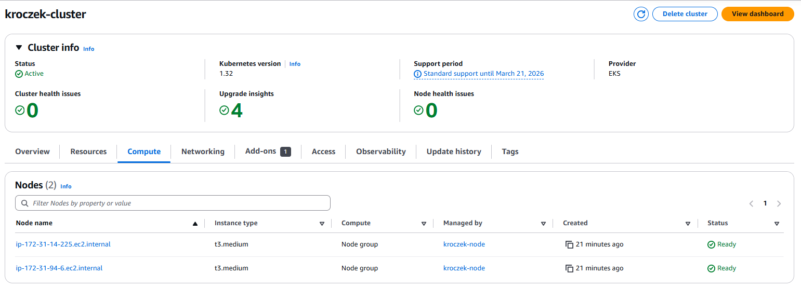

# LSC_LAB_06
Lab 6 of Large Scale Computing

# AWS setup
Configuration was done by aws EKS
- Created cluster
- Created nodes

# Kubernetes setup
aws configure set default.region us-east-1
aws configure set default.output table
aws eks describe-cluster --region us-east-1 --name kroczek-cluster --query cluster.status
aws eks --region us-east-1 update-kubeconfig --name kroczek-cluster

# Helm setup
helm repo add stable https://charts.helm.sh/stable
helm repo update
helm install nfs-server stable/nfs-server-provisioner --set storageClass.name=nfs-client-provisioner

# Creating Persistent Volume Claim (PVC)
kubectl apply -f pvc.yaml

# Deployment with HTTP server
kubectl apply -f deployment.yaml

# Creating service with pods
kubectl apply -f service.yaml

# Adding job
kubectl apply -f job.yaml

# Testing HTTP server
kubectl get svc web-server-service

